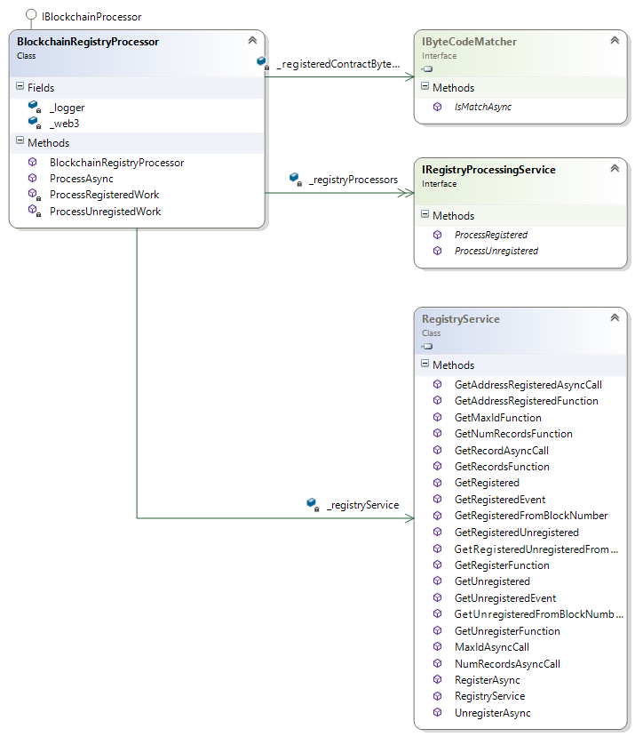
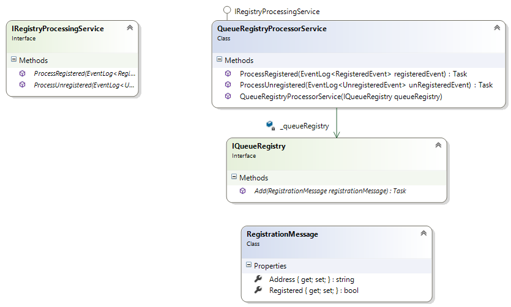

# Registry Processing
The registry processing component provides the components to monitor and backend processing of registration and unregistrations of addresses on a standard registration contract.

## Blockchain registry processor
The registry processor is an implementation of the IBlockchainProcessor, allowing it to be batched processed using the Batch Processor. 

A registry service is used to create a filter and retrieve the latests registrations and unregistrations in order for processing.

A prevalidation is also in place to match contracts bytecode registered to a preconfigured one (To avoid processing not wanted registrations)

Once retrieved all new registrations and unregistrations these are processed by all the implementations of IRegistryProcessingService configured.

## Queue registry processing service

A registration or unregistration can trigger much further processing which we might want to enqueue for scalability or decoupling or responsibilities.

In this scenario, we could use the generic implementation of a registry processor service with an implementation of IQueueRegistry.

 