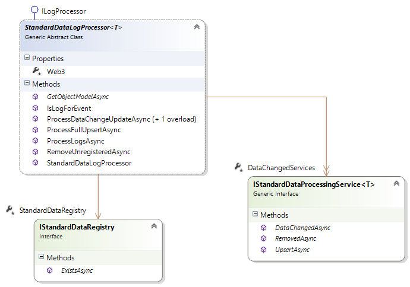

# Standard Data Processing

The standard data processing component allows to monitor and backend processing all the data changed events of contracts which follow the standard.

## Standard DataLog Processor

The StandardDataLogProcessor is an implementation of the ILogProcessor, allowing it to be plugged into the Blockchain Log Processor.

The log processor validates matching event logs and if contracts belong to the standard data registry.

## IStandardDataProcessingService

Different implementations of the IStandardDataProcessingService can be configured / registered either by code or Queues.
Current implementations stores the data in Azure Search for indexing, Azure Table Storage and Azure Sql.

